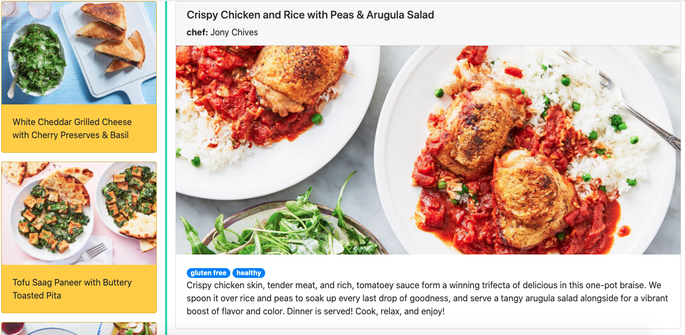

# README

This application was built using Ruby on Rails 6 whitout ActiveRecord. It is because is a lightweight app and does not need a database or the whole ORM methods. Instead of it I used Pure Ruby classes and coded the needed methods because of that the position is for a pure ruby developer.

* Ruby version: 2.6.3

* System dependencies: contenful, rspec

* How to run the test suite: rspec

* How to run the test suite: rails s

The url of the recipes is: http://localhost:3000/recipes/

I wanted to put a pretty UI and instead of showing two diferent views the layout is composed by the list at the left, and the details at the right. Internally it uses AJAX and pure javascript without Jquery to replace the detail view.

* screenshot:

